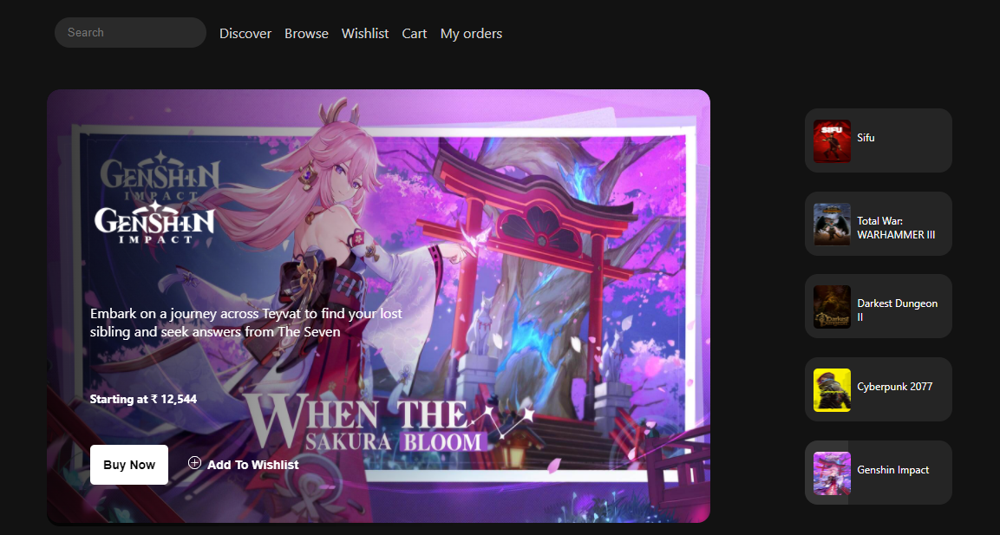

# epic-clone
An online store to buy various types of games like arcade, adventure, shooting, etc.
  

  
<h4>Tech Stack</h4>
 HTML |
 CSS |
 JAVASCRIPT |
 REACT |
 NODE |
 EXPRESS |
 MONGO 

<h4>Features</h4>
- Login/Signup  
- Seach any product (Debouncing)  
- Sort products based on price, alphabetical order,etc  
- Filter product based on genres  
- Wishlist  
- Cart  
- Payment  
<h4>Demo</h4>

  

 
<h3 align="left">Connect with me:</h3>

